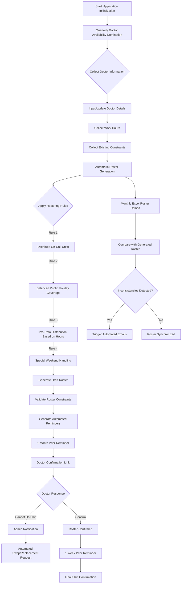

```mermaid
flowchart TD
    A[Start: Application Initialization] --> B[Quarterly Doctor Availability Nomination]
    B --> C{Collect Doctor Information}
    C --> D[Input/Update Doctor Details]
    D --> E[Collect Work Hours]
    E --> F[Collect Existing Constraints]
    
    F --> G[Automatic Roster Generation]
    G --> H{Apply Rostering Rules}
    H -->|Rule 1| I[Distribute On-Call Units]
    I -->|Rule 2| J[Balanced Public Holiday Coverage]
    J -->|Rule 3| K[Pro-Rata Distribution Based on Hours]
    K -->|Rule 4| L[Special Weekend Handling]
    
    L --> M[Generate Draft Roster]
    M --> N[Validate Roster Constraints]
    N --> O[Generate Automated Reminders]
    
    O --> P[1 Month Prior Reminder]
    P --> Q[Doctor Confirmation Link]
    Q --> R{Doctor Response}
    R -->|Confirm| S[Roster Confirmed]
    R -->|Cannot Do Shift| T[Admin Notification]
    
    T --> U[Automated Swap/Replacement Request]
    
    S --> V[1 Week Prior Reminder]
    V --> W[Final Shift Confirmation]
    
    G --> X[Monthly Excel Roster Upload]
    X --> Y[Compare with Generated Roster]
    Y --> Z{Inconsistencies Detected?}
    Z -->|Yes| AA[Trigger Automated Emails]
    Z -->|No| AB[Roster Synchronized]
```