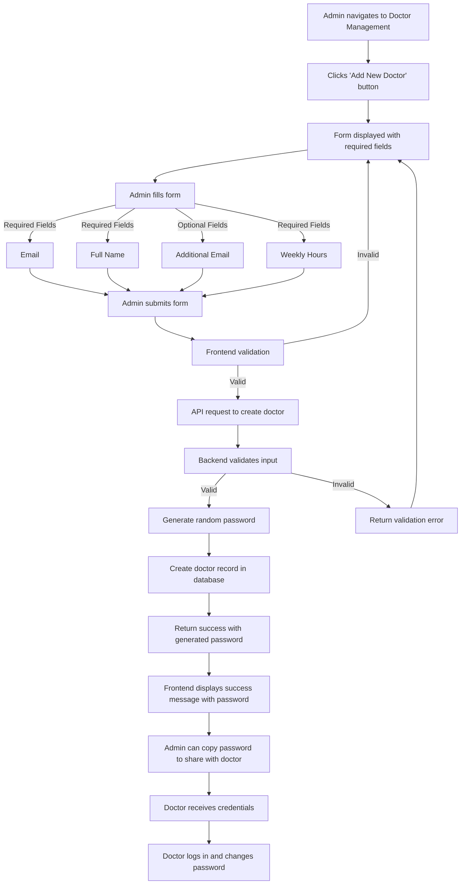

# Add Doctor Flow

This document outlines the flow for administrators to add a new doctor to the system.

## Process Flow

## Field Details

- **Email**: Primary email address for the doctor (required)
- **Full Name**: Doctor's complete name (required)
- **Additional Email**: Secondary email address (optional)
- **Weekly Hours**: Number of hours the doctor works per week (required)

## Password Handling

1. System generates a secure random password
2. Password is returned to the frontend only once during creation
3. Admin must securely share the password with the doctor
4. Doctor will be prompted to change password on first login

## Security Considerations

- Password is only displayed once at creation time
- No option to retrieve the original password later
- System should enforce secure password requirements on change
- All communication should occur over encrypted connections 